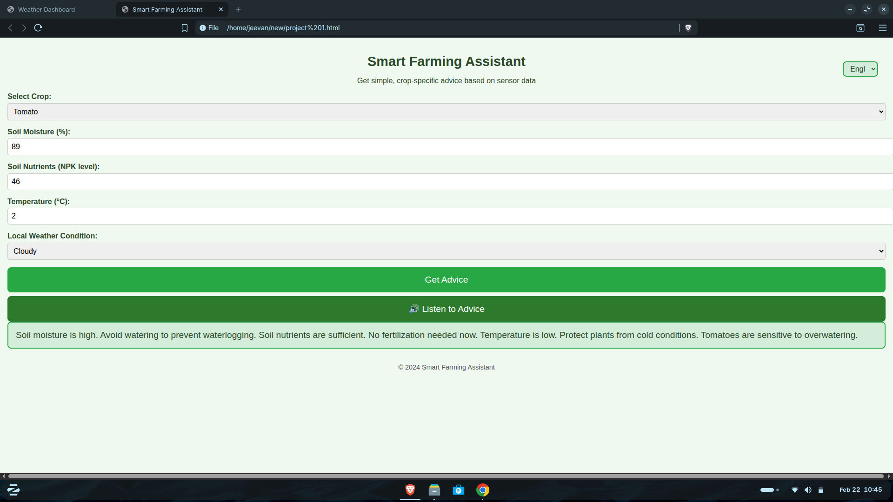
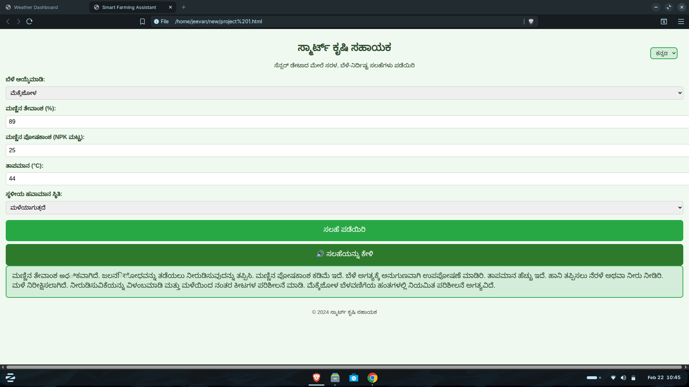

# Smart-Farming-Assistant
Smart Farming Assistant is an interactive, multilingual web application designed to bridge the gap between IoT sensor data and actionable agricultural insights. Developed to support farmers through technology, this project provides real-time, crop-specific advice based on environmental variables like soil moisture, nutrient levels, and temperature.

# Smart Farming Assistant - Agricultural HMI Web App
🌐 **Live Demo:** [Try the Smart Farming Assistant Here](https://smartfarmingassisstant.netlify.app/)

## 📸 Application in Action

**English Interface (Evaluating Tomato Crop Constraints):**

*The English UI demonstrating the threshold-based logic engine. Here, the app warns against watering tomatoes due to high soil moisture (89%) and provides alerts for low temperatures (2°C).*

**Kannada Interface (Evaluating Maize in Extreme Conditions):**

*The fully localized Kannada interface. In this scenario, the system processes high heat (44°C) and rainy conditions for a maize crop, ensuring local farmers receive critical, easy-to-read instructions in their native language.*

## 📖 Overview
The **Smart Farming Assistant** is a lightweight, dependency-free web application designed to serve as a Human-Machine Interface (HMI) for agricultural IoT systems. It bridges the gap between raw hardware sensor data and actionable farming practices by providing crop-specific advice based on real-time environmental variables. 

Designed with accessibility and local context in mind, the application features native bilingual support (English and Kannada) and built-in Text-to-Speech (TTS) capabilities, making it highly accessible for farmers in the field.

## 👥 Meet the Team
Developed by a team of 3rd-year Electronics and Communication Engineering (ECE) students at Don Bosco Institute of Technology:
* **Jeevan R**
* **Rachana R**
* **Pavan M**

## ✨ Key Features
* **Threshold-Based Logic Engine:** Evaluates critical inputs including Soil Moisture (%), Soil Nutrients (NPK), Temperature (°C), and Weather Conditions (Rainy, Dry, Sunny, Cloudy).
* **Crop-Specific Advisory:** Provides tailored irrigation, fertilization, and temperature management strategies for Maize, Rice, Beans, and Tomatoes.
* **Bilingual UI (i18n):** Seamless toggle between English and Kannada text to support local farmers.
* **Voice Accessibility:** Integrates the browser's native Web Speech API to read advice aloud in the selected language.
* **Vanilla Stack:** Built purely with HTML5, CSS3, and JavaScript. Zero external frameworks or libraries, ensuring blazing-fast load times and low data overhead.

## 🛠️ Technology Stack
* **Frontend:** HTML5, CSS3 (Mobile-first, responsive design)
* **Logic & Interactivity:** Vanilla JavaScript (ES6+)
* **APIs:** Native Web Speech API (`window.speechSynthesis`)

## 🚀 Project Context & Hardware Integration
This software interface is designed to complement our broader ECE hardware initiatives. It acts as the ideal frontend portal for physical IoT projects, such as:
* **Smart Automated Irrigation & Pond Water Level Systems:** Where ESP32/NodeMCU microcontrollers push live soil moisture and water level data to be read by this application.
* **IoT Sensor Nodes:** Capable of reading NPK and DHT11/DHT22 temperature data to feed directly into the app's logic engine. 

## 💻 How to Run Locally
Since this project uses a completely vanilla stack, no complex build tools or package managers (like npm) are required.
1. Clone the repository: `git clone https://github.com/yourusername/smart-farming-assistant.git`
2. Navigate to the project directory.
3. Simply open the `index.html` file in any modern web browser (Chrome, Edge, Firefox, Safari).

## 🔮 Future Scope
* API integration to pull live weather data (e.g., OpenWeatherMap) instead of manual user input.
* Backend database integration to log historical sensor data and track crop growth cycles.
* Direct WebSocket connection to ESP32 microcontrollers for real-time sensor data streaming.
Direct WebSocket connection to ESP32 microcontrollers for real-time sensor data streaming.
